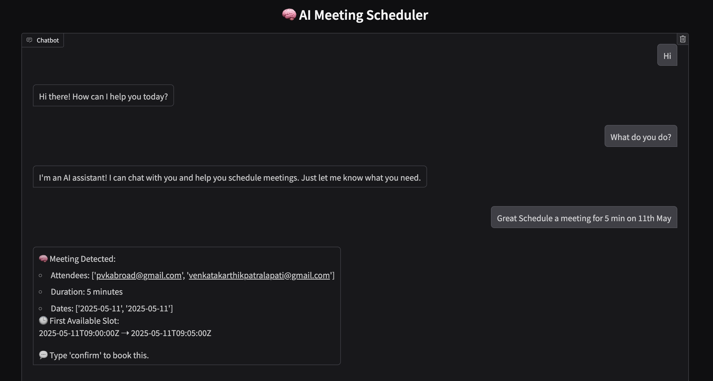
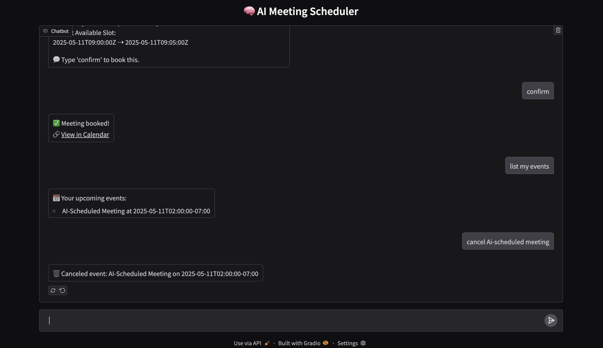

# 🧠 AI-Powered Smart Meeting Scheduler

This is a conversational assistant that helps you **schedule, list, and cancel meetings** on your **Google Calendar** — all through natural language prompts. Built using **Gemini 1.5 Flash**, **Google Calendar API**, and **Gradio**, this smart scheduler runs entirely in a single Google Colab notebook.

---

## 🖼️ Demo Screenshots

### 💬 Scheduling via Chat


### ✅ Booking Confirmation Output


---

## 🧩 Architecture Overview

```text
User Prompt
   ↓
Gemini 1.5 Flash (LLM)
   ↓
Structured JSON → Validated via Pydantic
   ↓
Google Calendar API (Check • Book • List • Cancel)
   ↓
Gradio Chat UI (Chat • Confirm • Cancel • View)


---

## ✅ Features

- ✍️ Natural language scheduling
- ✅ One-click meeting confirmation
- 📅 Lists upcoming Google Calendar events
- ❌ Cancels events by title (e.g., “cancel team sync”)
- 💬 Conversational responses from Gemini

---

## 🚀 How to Use

1. **Upload your `credentials.json`**  
   (Create OAuth client credentials at [Google Cloud Console](https://console.cloud.google.com/))

2. **Authenticate** when prompted during the first run

3. **Start chatting** in the Gradio UI. Try prompts like:


---

## ⚙️ Tech Stack

- [Gemini 1.5 Flash](https://makersuite.google.com/) – LLM via REST API
- [Google Calendar API](https://developers.google.com/calendar) – Create, list, delete events
- [Gradio](https://gradio.app/) – Web-based chat UI
- [Pydantic](https://docs.pydantic.dev/) – Data validation
- [Google Colab](https://colab.research.google.com/) – Zero setup runtime

---

## 📁 Notebook Info

📄 **File**: `AI_SMS.ipynb`  
🎯 All logic (auth, LLM, scheduling, Gradio UI) in a single notebook.

---

## 🙌 Author

**Venkata Karthik Patralapati**  
🎓 MS Applied Data Science  


